<div align="center">

# Bright Dental

**Dental practice management, from the first appointment to follow-up care.**

Patient, reception, dentist, and administrator workflows in one full-stack application.<br>
Containerized with Docker and configured for deployment on Microsoft Azure.

<p>
  <a href="#azure--docker-architecture"></a>
  <a href="#quick-start-with-docker"></a>
  <a href="#technology-stack"></a>
  <a href="#technology-stack"></a>
  <a href="#technology-stack"></a>
</p>

[Product tour](#product-tour) · [Database triggers](#core-database-triggers) · [Architecture](#azure--docker-architecture) · [Docker setup](#quick-start-with-docker) · [Azure deployment](#deploy-to-azure)

</div>

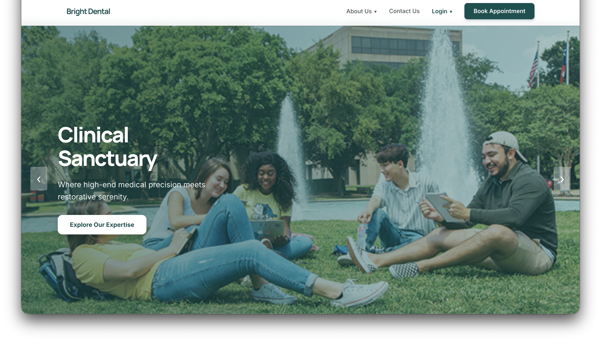

## Overview

Bright Dental brings appointment scheduling, patient records, clinical documentation, and billing into a shared clinic workflow. Dedicated portals help patients manage their care while receptionists, dentists, and administrators coordinate daily operations.

| Workspace | Capabilities |
| --- | --- |
| **Patient portal** | Request, reschedule, and cancel appointments; review invoices, visit history, and treatment plans; manage insurance and pharmacy preferences. |
| **Reception desk** | Manage appointment requests, patient registration, daily schedules, check-ins, recalls, and insurance or pharmacy changes. |
| **Dentist workspace** | Review patient profiles, document dental findings, manage treatment plans, and record completed procedures. |
| **Administration** | Manage staff and locations; filter appointment reports; review charges, coverage, payments, refunds, and outstanding balances. |

## Azure & Docker architecture

The repository includes a **multi-stage Docker image**, a **Docker Compose environment**, and an **Azure deployment workflow**. One application container serves the compiled React frontend and Node.js API on the same origin.

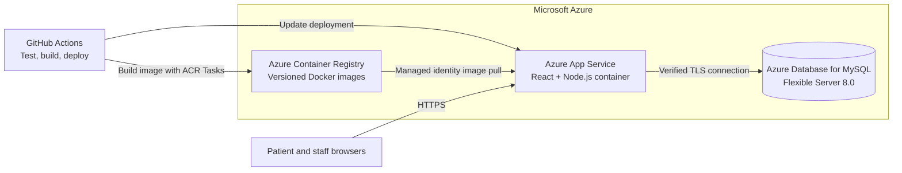

| Deployment component | Implementation |
| --- | --- |
| **Container image** | [Dockerfile](Dockerfile) builds React with Node 22, installs production API dependencies, and runs as a non-root user. |
| **Local environment** | [Docker Compose](compose.yaml) starts the application and MySQL with database health checks and a persistent volume. |
| **Azure provisioning** | [Deployment script](scripts/deploy-azure.sh) configures App Service, Container Registry, MySQL, HTTPS, runtime settings, and firewall rules. |
| **CI/CD** | [GitHub Actions](.github/workflows/azure.yml) verifies the container with MySQL before the configured Azure deployment job. |
| **Startup & health** | Database bootstrap applies pending migrations before startup; readiness checks verify MySQL connectivity; shutdown allows active requests to finish. |

Azure deployment requires your subscription settings and credentials. See the [deployment guide](docs/azure-deployment.md) for provisioning, OIDC authentication, data migration, and rollback.

## Product tour

Demo screens covering the patient journey and clinic operations. Select an image to view it at full resolution.

### Patient experience

<table>
  <tr>
    <td width="50%" valign="top">
      <strong>Appointment intake</strong><br>
      A guided registration flow for new patient appointment requests.
      <a href="docs/images/appointment-intake.png">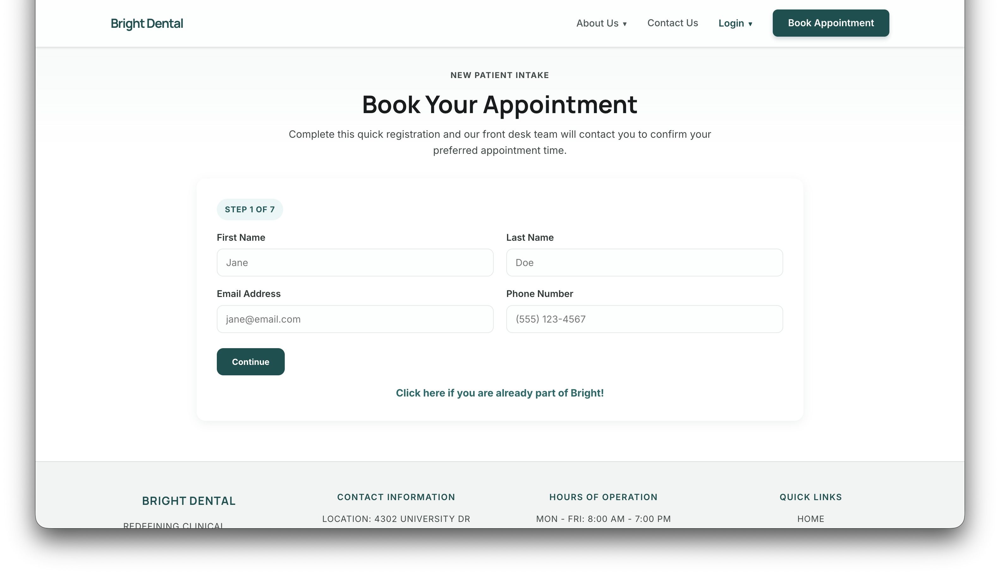</a>
    </td>
    <td width="50%" valign="top">
      <strong>Patient dashboard</strong><br>
      Upcoming care, primary dentist, contact details, and invoice summaries.
      <a href="docs/images/patient-dashboard.png">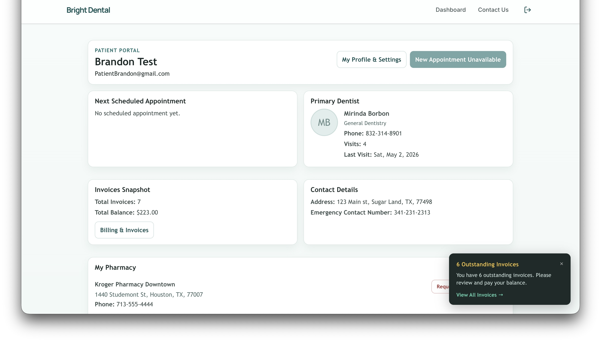</a>
    </td>
  </tr>
  <tr>
    <td width="50%" valign="top">
      <strong>History & preferences</strong><br>
      Insurance, prescriptions, previous visits, and appointment requests.
      <a href="docs/images/patient-history.png">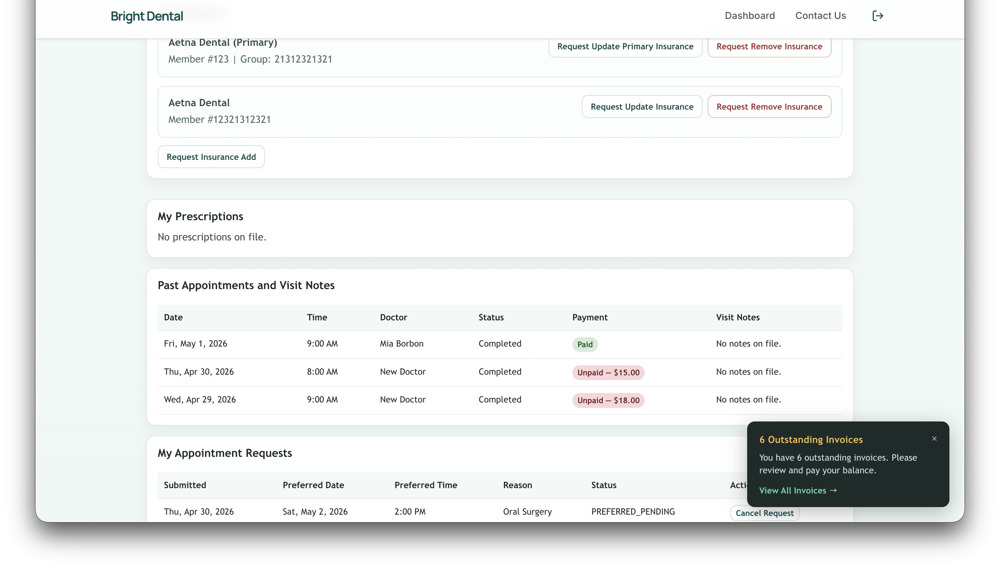</a>
    </td>
    <td width="50%" valign="top">
      <strong>Billing & invoices</strong><br>
      Itemized charges, insurance coverage, payments, refunds, and balances.
      <a href="docs/images/billing-invoices.png">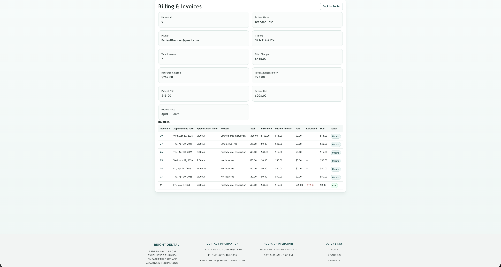</a>
    </td>
  </tr>
</table>

### Clinic operations

<table>
  <tr>
    <td width="50%" valign="top">
      <strong>Staff sign-in</strong><br>
      A dedicated entry point for the clinic staff portal.
      <a href="docs/images/staff-login.png">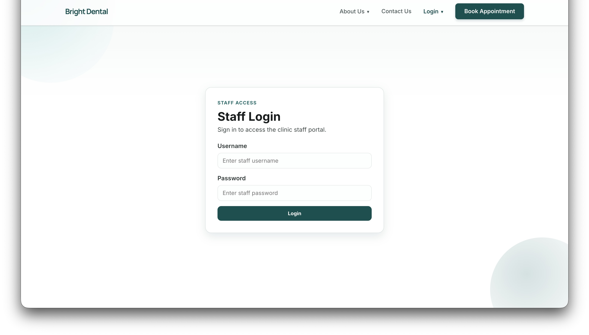</a>
    </td>
    <td width="50%" valign="top">
      <strong>Reception dashboard</strong><br>
      Staff schedules, patient search, appointment requests, and daily status filters.
      <a href="docs/images/receptionist-dashboard.png">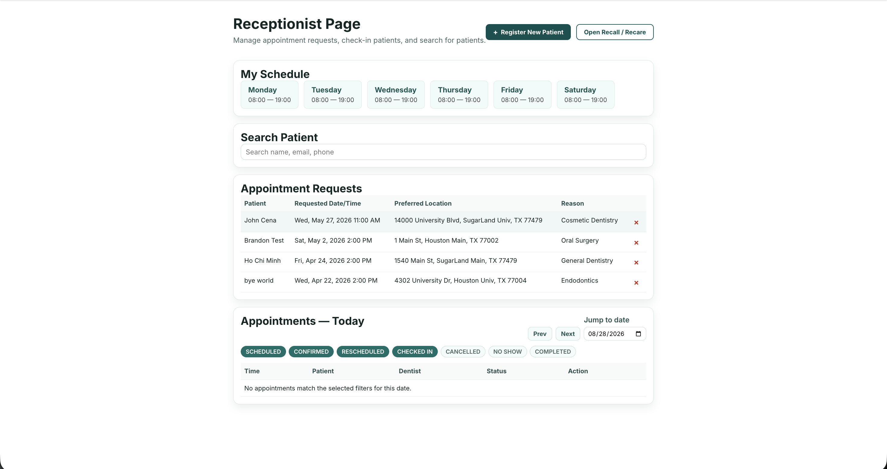</a>
    </td>
  </tr>
  <tr>
    <td width="50%" valign="top">
      <strong>Dentist workspace</strong><br>
      Weekly availability, upcoming appointments, and past visits.
      <a href="docs/images/dentist-dashboard.png">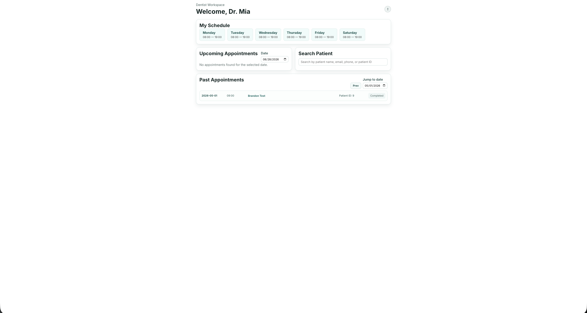</a>
    </td>
    <td width="50%" valign="top">
      <strong>Patient coordination</strong><br>
      Contact and medical information alongside appointment assignment and pharmacy details.
      <a href="docs/images/patient-profile.png">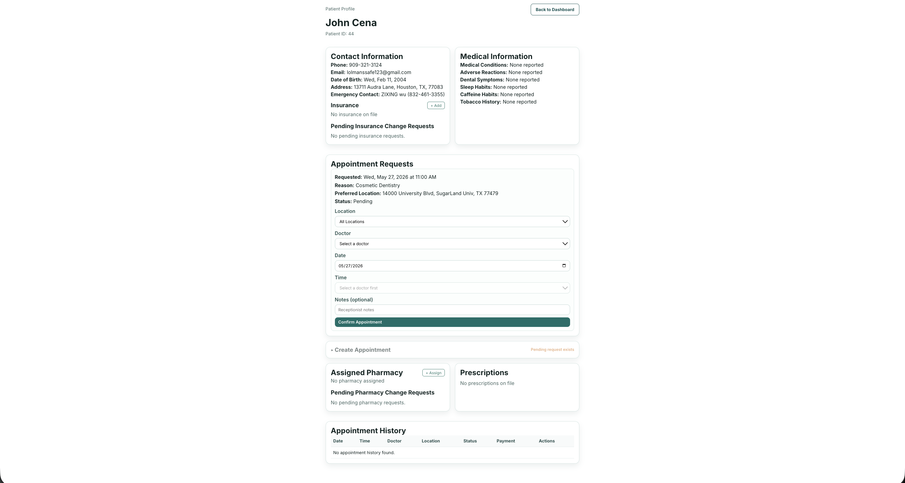</a>
    </td>
  </tr>
</table>

### Clinical documentation

<table>
  <tr>
    <td width="50%" valign="top">
      <strong>Clinical record</strong><br>
      Medical history, completed treatments, and a tooth-number reference.
      <a href="docs/images/clinical-record.png">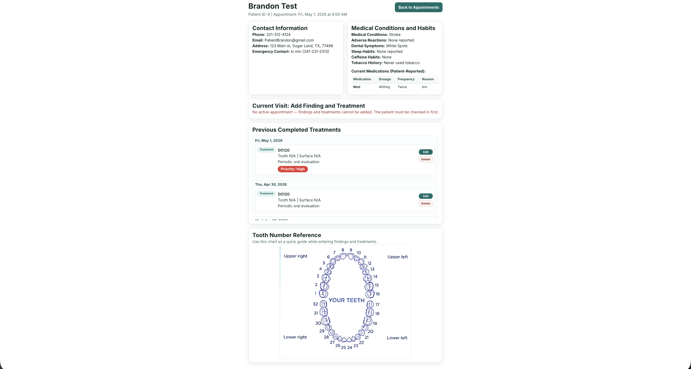</a>
    </td>
    <td width="50%" valign="top">
      <strong>Treatment editor</strong><br>
      Procedure codes, tooth and surface details, estimated costs, priority, and follow-up notes.
      <a href="docs/images/treatment-editor.png">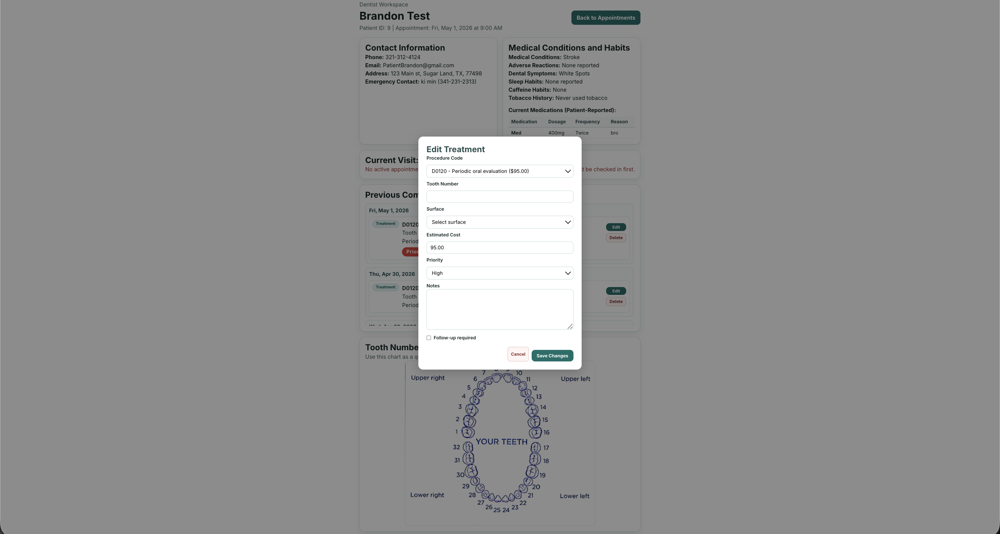</a>
    </td>
  </tr>
</table>

## Core database triggers

MySQL triggers run automatically when records change, enforcing business rules at the database level. These three protect the core booking, appointment, and billing workflows.

### 1. Validate appointment bookings

**`appointments_validate_slot_on_insert`** · `BEFORE INSERT` on `appointments`

Checks that the selected slot matches the appointment's **doctor, location, date, and time**. For a booking whose status is neither `CANCELLED` nor `NO_SHOW`, it also rejects the insert if the slot already contains another appointment with a status outside those two values. Invalid bookings raise a database error before the row is saved.

**Example:** Booking a 9:00 AM slot with a different doctor, or inserting another active appointment into an occupied slot, is rejected.

[View trigger SQL](database/migrations/2026-04-20-recreate-missing-validation-triggers.sql#L39)

### 2. Protect appointment status transitions

**`appointments_enforce_status_transition`** · `BEFORE UPDATE` on `appointments`

Prevents status changes once an appointment is **`COMPLETED` or `CANCELLED`**. A **`CHECKED_IN`** appointment may only move to `COMPLETED` or `CANCELLED`, keeping the visit workflow consistent across application entry points.

**Example:** `CHECKED_IN → COMPLETED` is allowed; `COMPLETED → SCHEDULED` is rejected.

[View trigger SQL](database/schema.sql#L1372) · [Runtime definition](server.js#L481)

### 3. Recalculate invoice payment status

**`after_payment_insert_update_invoice_status`** · `AFTER INSERT` on `payments`

After a payment is recorded, recalculates the invoice's **net paid amount** as total payments minus recorded refunds. It compares that amount with the patient's responsibility and sets the invoice to **`Paid`**, **`Partial`**, or **`Unpaid`**, marking the update as trigger-generated.

**Example:** For a $100 patient balance with no refunds, a $40 payment sets the invoice to `Partial`; another $60 payment changes it to `Paid`.

[View trigger SQL](database/schema.sql#L1333)

## Technology stack

| Layer | Technology |
| --- | --- |
| **Frontend** | React 19, Vite 7, React Router |
| **Backend** | Node.js 22 container runtime, HTTP API, mysql2 |
| **Database** | MySQL 8.0, SQL schema, versioned migrations |
| **Containers** | Docker multi-stage build, Docker Compose |
| **Azure services** | App Service for Linux, Container Registry, Database for MySQL Flexible Server |
| **Automation** | GitHub Actions, Azure CLI, shell deployment scripts |

## Quick start with Docker

**Prerequisites:** Docker Engine or Docker Desktop, with Docker Compose.

```bash
cp .env.example .env
```

Set unique `DB_PASSWORD`, `MYSQL_ROOT_PASSWORD`, and `ADMIN_SECRET` values in `.env`, then start the application:

```bash
docker compose up --build -d --wait
```

Open **[http://localhost:3001](http://localhost:3001)**. Set `APP_PORT` in `.env` to use another host port. MySQL stays on the internal Compose network and stores data in the `mysql-data` volume.

| Task | Command |
| --- | --- |
| Follow application logs | `docker compose logs -f app` |
| Verify database schema | `docker compose exec app npm run verify:schema` |
| Check application readiness | `bash scripts/check-deployment.sh http://localhost:3001` |
| Stop services and retain data | `docker compose down` |

> **Database persistence:** `docker compose down -v` permanently deletes the local database volume. Changing passwords in `.env` does not update accounts in an existing MySQL volume.

## Deploy to Azure

**Prerequisites:** Azure CLI, Python 3, curl, Git, and an Azure subscription with the permissions described in the [deployment guide](docs/azure-deployment.md).

```bash
cp .env.azure.example .env.azure
```

Fill in your subscription ID, unique resource names, and secrets, then run:

```bash
az login
npm run deploy:azure
```

The deployment script builds the Linux container image in Azure Container Registry, provisions the application and MySQL services, configures runtime secrets and networking, and checks readiness. A local Docker engine is optional for this Azure build path.

To enable automated deployment, configure the GitHub `production` environment, Azure OIDC identity, repository variables, and `AZURE_DEPLOY_ENABLED=true` as documented in the [GitHub Actions setup](docs/azure-deployment.md#github-actions).

> **Deployment scope:** Provisioning creates billable Azure resources. Existing data and custom-domain DNS require a separate cutover; follow the [data migration steps](docs/azure-deployment.md#existing-data-and-cutover).

## Local development

Use **Node.js 22** and an existing **MySQL 8.0** database. Copy `.env.example` to `.env` and configure `DB_HOST`, `DB_PORT`, `DB_USER`, `DB_PASSWORD`, and `DB_NAME` for that database.

```bash
npm ci
npm ci --prefix clinic-medical
npm run dev
```

Start the Vite frontend in a second terminal:

```bash
npm run dev --prefix clinic-medical
```

Vite proxies `/api` to the backend on port 3001. Production serves the UI and API from the same container. `VITE_API_URL` is an optional build-time override for standalone frontend builds.

```bash
npm test       # Database configuration tests
npm run build # Production frontend build
npm start     # Bootstrap database and start the server
```

The base schema does not create live user accounts. Import your existing database to retain accounts and clinical data. `ADMIN_SECRET` supports the existing administrator login flow; it does not create an administrator account.

## Repository guide

```text
Bright_Dental/
├── clinic-medical/          React frontend
├── routes/                  API route handlers
├── database/                MySQL configuration, schema, and migrations
├── docker/                  Container startup and health checks
├── scripts/                 Azure deployment and readiness verification
├── docs/                    Deployment guide and demo screenshots
├── test/                    Database configuration tests
├── .github/workflows/       Container verification and Azure deployment
├── Dockerfile               Production application image
├── compose.yaml             Local application and MySQL services
└── server.js                API server and frontend hosting
```

---

<div align="center">

**Bright Dental** · Patient care and clinic operations, connected.

[Explore the demo](#product-tour) · [Run with Docker](#quick-start-with-docker) · [Deploy to Azure](docs/azure-deployment.md)

</div>
